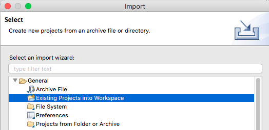
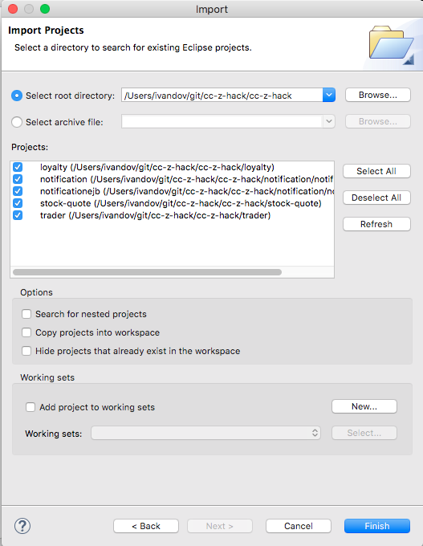

### Importing into Eclipse
Many of these services are written in Java and can be imported directly into Eclipse. I suggest creating a new workspace before importing so as not to clutter existing workspaces.

First clone this git repository to some local directory.
```
git clone git@github.ibm.com:cc-z-hack/cc-z-hack.git
```

1. Open the **Java EE perspective** and
1. In the **Project Explorer** tab, right click and select **Import -> General -> Existing Projects into Workspace**

1. Press **Next**
1. Press **Browse** Next to the **Select root directory** radio button and navigate to where you performed the `git clone`

1. Keep all projects selected and press **Finish**
